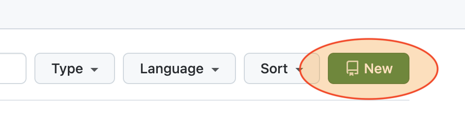
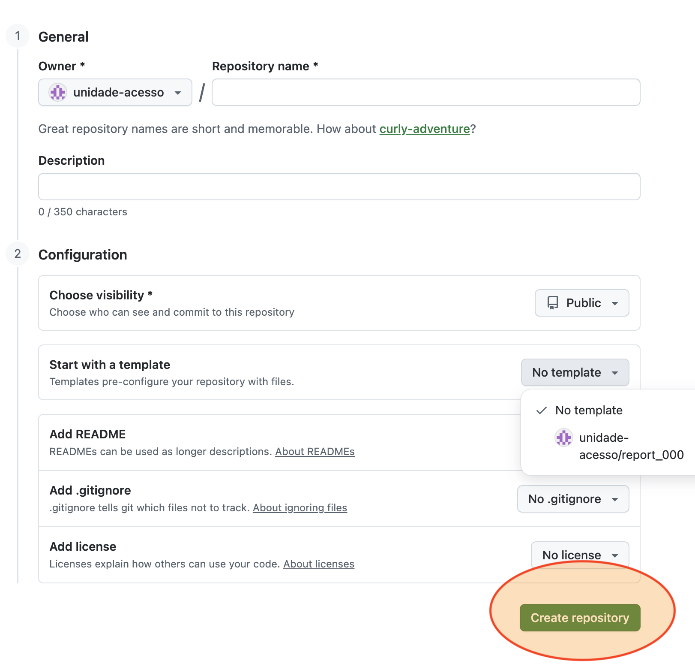
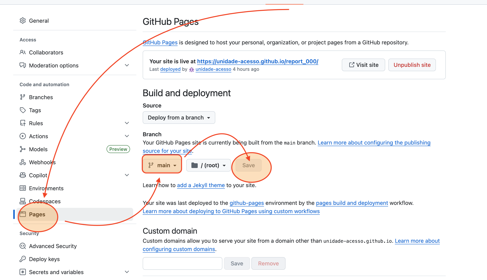
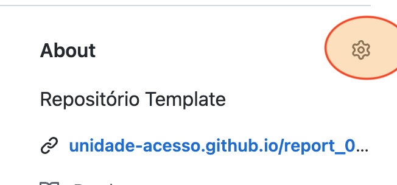
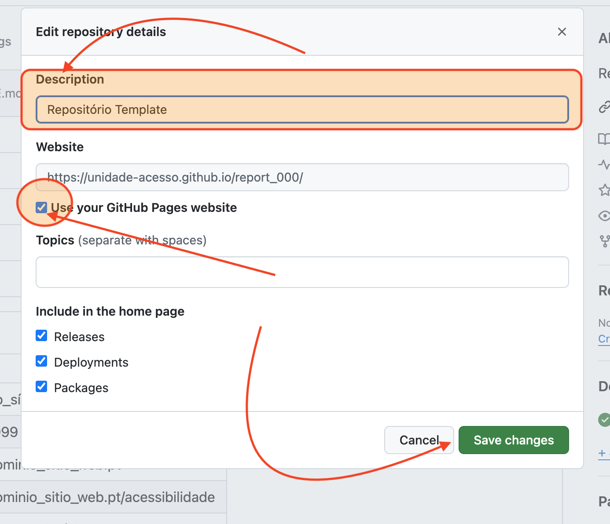
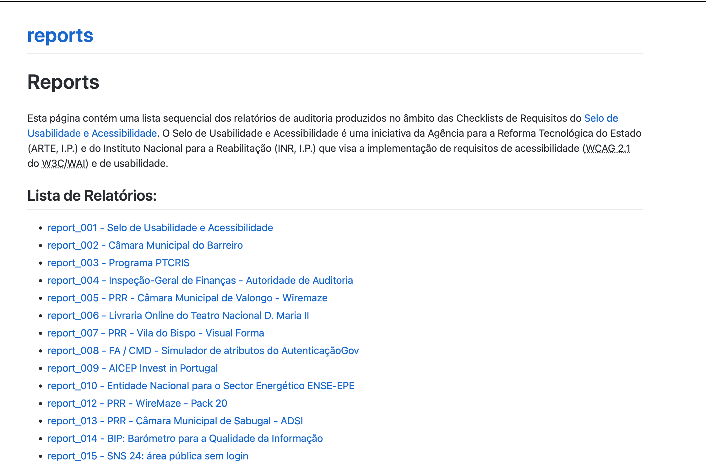

# Criar repositório para armazenar relatório de auditoria

Cada repositório Git armazena 1 relatório com todo o seu historial ao longo do tempo.

Cada repositório é composto por:
- uma folha de rosto - ficheiro `README.md` - publicada como se fosse uma página web. Nesta folha de rosto encontram-se links para a última versão do relatório de auditioria e links para os vários relatórios já produzidos ao longo do tempo;
- ficheiros .html que contêm os respetivos relatórios que se encontram hiperligados na folha de rosto do relatório;
- No separador "issues" enocntram-se todas as ocorrências alvo de auditoria ou análise. Cada uma das ocorrências, ou notas de auditoria, estão etiquetadas com as etiquetas de "requisitos" ou "capítulos" e respetivo julgamento: "OK" (se satisfazem o requisito ou padrões do capítulo); "NOK" (se não satisfazem o requisito ou padrões do capítulo); "N/A" (se requisito não é aplicável à análise em causa).

Para criar um repositório e parametrizá-lo siga os seguintes passos.

## 1º passo: Login Repositório unidade-acesso

No browser ir a:

URL: <https://github.com>
User: unidade-acesso

## 2º passo: Criar novo repositório

Vamos criar um repositório com base num repositório "template". Desta forma, o ficheiro `README.md` - uma espécie de folha de rosto do repositório - fica criado, a estrutura de pastas também e, mais importante, as etiquetas que vão ser utilizadas para etiquetar cada issue ficam prontas a usar.

Antes de criar o repositório é importante determinar qual é o nome do repositório. No nosso sistema, o nome de cada repositório encontra-se neste formato:

- report_001
- report_002
- (...)
- report_xxx

Encontramos a lista de repositórios neste endereço:

URL: <https://github.com/unidade-acesso?tab=repositories>

Também pode ser visto neste endereço:

URL: <https://unidade-acesso.github.io/reports/>

A ideia é verificar qual é o último relatório e criarmos o novo com o número sequencial seguinte. Por exemplo, se o último for o "report_101" então vamos usar "report_102". Se introduzirmos "report_101" como nome do novo repositório o Git avisa e não deixa criar. Também é possível, posteriormente, renomear o repositório. 

Na lista de repositórios é possível ordenar a lista por nome, o que facilita a perceção de qual é o nome do último relatório.

Determinado o nome do nosso novo repositório - vamos imaginar que é "report_099", estamos prontos para criar o repositório.

Ainda na página dos repositórios procuramos o botão "New" que está no canto superior direito do ecrã.



Desta forma entramos na página: 

URL: <https://github.com/new>

Nesta página, vamos preencher os campos:

- Repository name, por exemplo com report_099;
- Description, por exemplo, Câmara Municipal de Lisboa;
- Choose visibility, vamos deixar public;
- Start with a template, na caixa de lista vamos escolher "unidade_acesso/report_000". 

Deixamos os restantes campos como estão e pressionamos no botão "Create repository".



E está feito! :-) Acabámos de criar o repositório que vai ser a casa do nosso relatório e de tudo aquilo que o envolve.

## 3º passo: vamos agora abrir o repositório gerado

Vamos agora entrar no repositório. Por exemplo, se criámos o report_099, então ele estará em:

URL: <https://github.com/unidade-acesso/report_099>

Vamos começar por alterar a folha de rosto do nosso repositório.  Atualmente no `README.md` temos uma espécie de template que foi copiada do repositório report_000 que serviu de base à construção do presente repositório. 
 
 Para alterar o ficheiro `README.md` usamos o botão “edit file”.
 


A extensão ".md" indica que se trata de um ficheiro escrito em Markdown, uma espécie de braço direito do HTML- HyperText Markup Language. Do markdown consegue-se chegar automaticamente a HTML - o Git faz isso sozinho - e o markdown é mais fácil e rápido de escrever. 

O `README.md` encontra-se dividido em duas partes essenciais: 
- os metadados, ou variáveis, que contém todas as variáveis que vamos  usar no nosso ficheiro, e;
- a informação que vai ficar pública na página Web e que servirá de folha de rosto do nosso repositório.

A lógica de concentrar todas as variáveis, ou campos de edição, numa só zona - nos metadados - visa facilitar o preenchimento. Significa isto que preenchido esta zona dos metadados, a nossa folha de rosto está pronta. Ou melhor, quase pronta :-). Há uma exceção nesta lógica que é a lista dos relatórios históricos (que trataremos em capítulo à parte, mais abaixo).

Mas, comecemos pelos metadados, variáveis que estão entre as linhas delimitadas pelos caracteres "---". Tecnicamente esta zona dos metadados é também designada por front-matter do ficheiro.

```liquid

---
website: "Nome_do_sítio_Web"          # Entre as aspas escreve o nome do website
date: "31/12/1999"                    # Entre as aspas escreve a data de criação do 1º relatório. Os restantes estão no histórico
uri: "https://dominio_sitio_web.pt"   # Entre as aspas escreve o domínio do website
a11y_statement: "https://dominio_sitio_web.pt/acessibilidade" # Entre as aspas escreve o URL da Declaração de Acessibilidade do website
owner: "Nome_do_proprietário"         # Entre as aspas escrever o nome do owner do website
seal: "_Ouro_" 
---

```

Agora que preenchemos os 6 campos com a informação do sítio Web que vai ser auditado, podemos "gravar" o ficheiro. Na linguagem do Git "gravar" significa efetuar "Commit". É, mais uma vez, um botão que se encontra no canto superior direito da viewport do ficheiro `README.md`.


Feito e aceite o "Commit", o ficheiro `README.md` está pronto.

Para já, e ainda antes de começarmos a registar os nossos issues, ou notas de auditoria, vamos tornar a folha de rosto do nosso repositório visível como se fosse uma página Web.

## 4º passo: publicar a folha de rosto do repositório como se fosse uma página Web
 
Ainda na página do repositório, por exemplo do report_099, vamos à opção "Settings" e, no menu secundário, escolhemos a opção "Pages". Isto leva-nos à página "GitHub Pages". Aqui vamos à secção "Build and deployment". Nesta secção vamos escolher a branch "main" e usamos o botão "save" para gravar esta configuração.

E com isto a nossa página de rosto já é uma página Web. Em que endereço está? Já vamos ver...



Antes disso, no menu principal, podemos voltar a selecionar a opção "Code" e abrir a secção "About" - uma das primeiras secções existentes na coluna do lado direito.



Clicamos no botão "Edit repository metadata", que se encontra ao lado do título da secção "About" e que tem o desenho de uma roda dentada.

Isso faz abrir uma caixa de diálogo.



Nesta caixa de diálogo, vamos preencher:
- Description, com o nome do sítio Web, e;
- selecionamos a checkbox "Use your Github pages website".

Pressionamos o botão "Save changes" e a nossa folha de rosto já pode ser visível em:

URL: <https://unidade-acesso.github.io/report_099/README>

## 5º passo: Registar o Relatório no índice de relatórios

No ficheiro `README.md` do repositório "Reports" mantemos um indice dos repositórios produzidos ou em produção. Se a equipa respeitar sempre este passo quando gera um repositório, vai ser possível encontrar qualquer relatório produzido ou em produção de forma rápida. Podemos usar a pesquisa do browser para pesquisar pelo nome do website.

Para registar o nosso relatório no índice vamos ao repositório "reports":

URL: <https://unidade-acesso.github.io/reports/>

E editamos o `README.md` deste repositório para acrescentar o nosso relatório. 



Com isto, estamos prontos para começar a nossa auditoria, a qual se faz na opção issues.

## 6º passo: Registar e etiquetar issues

Vamos então realizar a nossa auditoria no repositório recentemente criado - o report_099. Vamos a:

URL: <https://github.com/unidade-acesso/report_099/issues/>

(...)

## 7º passo: Gerar o relatório via script GitReports

O gerador de relatórios GitReports encontra-se em:

URL: http://10.55.37.17/gitreports/v2/reporte.html

(...)

## 8º passo: Efetuar upload do relatório e notificar o "cliente"

O upload do relatório faz-se de novo no endereço do repositório onde está o `README.md` - a chamada "root" ou "diretoria raíz" do repositório.

URL: <https://github.com/unidade-acesso/report_099/>

O upload passa sempre por publicar 2 cópias do relatório que foi retirado do gerador GitReports.

Imaginemos que hoje é 01/04/2030 e que retirámos o ficheiro report.html do GitReports. Primeiro, a partir desse ficheiro, criamos 2 ficheiros iguais com os nomes: 

- report.html
- 01042030_report.html

Para efetuar o upload destes ficheiros no nosso repositório vamos escolher a opção "Add file > Upload files". 

Depois de carregados os dois ficheiros, eles vão surgir na diretoria "raíz" do nosso repositório. Isto é, na mesma diretoria onde está o `README.md`. 

Lembram-se da excepção de edição fora da zona de metadados no `README.md` que falámos antes. Pois é. É aqui que entra. Temos de adicionar à nossa lista de relatórios históricos o nosso relatório agora criado.

(...) 

